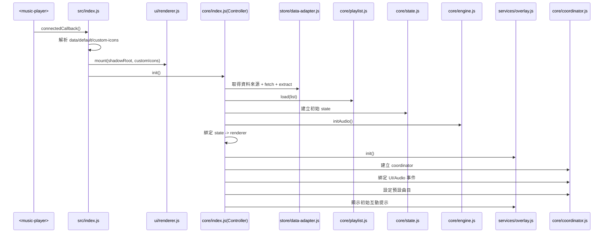
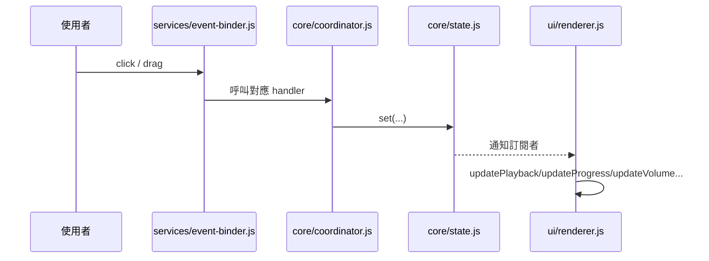
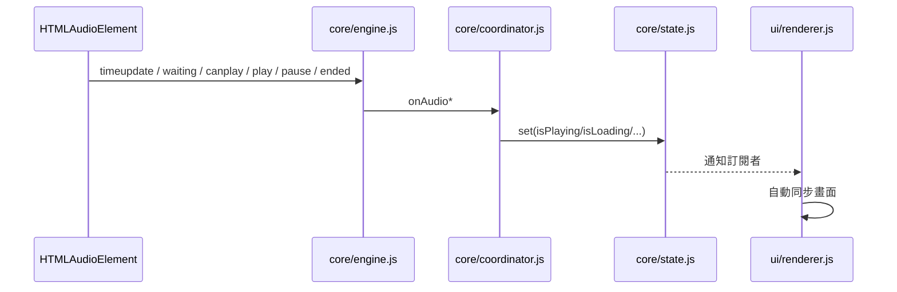

# Music Player Web Component — 架構說明

---

## 一、目前架構總覽

- `core/`：播放核心（狀態、引擎、歌單、流程協調）
- `store/`：資料來源與資料格式轉接
- `services/`：把「使用者操作 / audio 事件」轉交給核心邏輯，並管理 overlay 互動流程
- `ui/`：視圖模板、樣式、渲染器
- `utils/`：通用工具

核心目標是：

- 邏輯與 UI 解耦（由 `State` 驅動 UI）
- 音訊底層封裝（由 `AudioEngine` 統一對外）
- 模組職責單一（方便維護與替換）

---

## 二、目錄結構（現行）

```text
music-player/
├── src/                               # 組件主程式碼
│   ├── index.js                       # Web Component 入口（解析屬性、啟動 Controller）
│   ├── config.js                      # 預設值與常數
│   ├── assets/images/                 # 內建 icon 資源
│   ├── core/                          # 播放核心邏輯
│   │   ├── index.js                   # 核心組裝中心（串接各模組）
│   │   ├── state.js                   # 狀態容器（get/set/on）
│   │   ├── coordinator.js             # 播放流程決策與事件處理
│   │   ├── engine.js                  # 音訊引擎封裝（audio/WebAudio）
│   │   └── playlist.js                # 歌單策略（next/prev/shuffle/history）
│   ├── store/                         # 資料來源與轉接
│   │   └── data-adapter.js            # 載入資料與 payload 標準化
│   ├── services/                      # 服務層（接線與互動）
│   │   ├── event-binder.js            # UI/Audio 事件接到 coordinator
│   │   └── overlay.js                 # 初次互動與靜音提示流程
│   ├── ui/                            # 呈現層
│   │   ├── renderer.js                # 掛載模板樣式、統一 update/render
│   │   ├── components/                # 各視圖模板
│   │   │   ├── player-view.js         # 播放器主視圖
│   │   │   ├── list-view.js           # 清單視圖
│   │   │   └── overlay-view.js        # overlay 視圖/樣式注入
│   │   └── styles/                    # 對應視圖樣式
│   │       ├── player-view.css
│   │       ├── list-view.css
│   │       └── overlay-view.css
│   └── utils/                         # 通用工具
│       ├── css-loader.js              # 載入 CSS 文字
│       ├── drag.js                    # 拖曳與 pointer 互動
│       ├── format.js                  # 格式化（時間）
│       └── path-resolver.js           # 資源路徑解析
└── documents/                         # 文件
    ├── guide.md                       # 使用者接入指南
    └── details.md                     # 架構設計說明
```

---

## 三、分層職責

| 層級   | 位置                        | 主要責任                                               |
| ------ | --------------------------- | ------------------------------------------------------ |
| 邊界層 | `src/index.js`              | Web Component 入口，解析屬性、掛載 UI、建立 Controller |
| 核心層 | `src/core/`                 | 播放決策、狀態管理、播放清單策略、音訊引擎封裝         |
| 數據層 | `src/store/data-adapter.js` | 決定資料來源、抓資料、轉成標準歌單                     |
| 服務層 | `src/services/`             | UI/Audio 事件接線、overlay 互動流程                    |
| 呈現層 | `src/ui/`                   | 模板組裝、CSS 載入、畫面更新                           |
| 工具層 | `src/utils/`                | 路徑、時間格式、拖曳、CSS 載入工具                     |

---

## 四、關鍵檔案對照

| 檔案                           | 說明                                                                                                                                                           |
| ------------------------------ | -------------------------------------------------------------------------------------------------------------------------------------------------------------- |
| `src/index.js`                 | 定義 `<music-player>`；解析 `data-*`、`default-*`、`custom-icons`；呼叫 `Controller.init()`                                                                    |
| `src/core/index.js`            | 核心組裝中心：`DataAdapter -> Playlist -> AudioEngine -> PlaybackCoordinator`，並建立 `state -> renderer` 訂閱                                                 |
| `src/core/state.js`            | 輕量狀態容器（`get/set/on`），是 UI 同步的單一事實來源                                                                                                         |
| `src/core/coordinator.js`      | 播放流程核心：播放/暫停、上一首/下一首、拖曳進度、拖曳音量、repeat/shuffle、audio 事件處理                                                                     |
| `src/core/engine.js`           | 音訊控制中介層：統一封裝 `play/pause/seek/volume/muted/load`、管理 Web Audio 初始化與恢復，並集中綁定 audio 事件；讓其他模組不用直接碰 `HTMLAudioElement` 細節 |
| `src/core/playlist.js`         | 歌單策略：default/next/prev/shuffle/history，並保存 `sessionStorage` 歷史                                                                                      |
| `src/store/data-adapter.js`    | 資料來源判斷（endpoint/url/window）與 payload 解析（`data/list/items`）                                                                                        |
| `src/services/event-binder.js` | 把 UI 點擊/拖曳與 audio 事件，接到 coordinator                                                                                                                 |
| `src/services/overlay.js`      | 初次互動提示與靜音提示的生命週期與按鈕行為                                                                                                                     |
| `src/ui/renderer.js`           | 渲染器：掛載 view+css，提供 `update*` / `renderPlaylist` / `highlightTrack`                                                                                    |

---

## 五、初始化流程



解讀重點（初始化）：

1. `src/index.js` 是 Web Component 入口，負責讀取 `data-endpoint` / `data-url` / `default-*` / `custom-icons`。
2. `ui/renderer.js` 先把畫面（Shadow DOM + CSS）掛起來，確保後續狀態可以立即反映在 UI 上。
3. `core/index.js`（`Controller`）才開始串核心流程：  
   `store/data-adapter.js` 取資料 -> `core/playlist.js` 載入歌單 -> 建立 `core/state.js` / `core/engine.js`。
4. `Controller` 會建立「`state -> renderer` 訂閱」，所以後續只要 `state.set(...)`，UI 就會自動更新。
5. 初始化最後才建立 `core/coordinator.js` 與 `services/overlay.js`，並綁定事件、設定預設曲目、顯示初始互動提示。

---

## 六、執行時事件流

### 1) 使用者操作流程



解讀重點（使用者操作）：

1. 使用者在 UI 的點擊或拖曳，先由 `services/event-binder.js` 接住。
2. `event-binder.js` 不做商業邏輯，只負責把事件轉交給 `core/coordinator.js`（例如 `onPlayPauseClick`、`onVolumeDrag`）。
3. `coordinator.js` 處理播放決策後，只更新 `core/state.js`（`set(...)`），不直接改整體 UI。
4. `ui/renderer.js` 透過訂閱 `state` 變化，自動執行 `updatePlayback`、`updateProgress`、`updateVolume` 等方法。

重點：`coordinator` 不直接操作整體 UI 狀態，而是先改 `state`，由 `renderer` 被動同步。

### 2) 音訊事件流程



解讀重點（audio 事件）：

1. 原生 `HTMLAudioElement` 發出的事件（`timeupdate`、`waiting`、`canplay`、`play`、`pause`、`ended`）先進入 `core/engine.js`。
2. `engine.js` 會把這些事件統一轉交給 `core/coordinator.js` 的 `onAudio*` 方法。
3. `coordinator.js` 根據事件更新 `state`（例如 `isPlaying`、`isLoading`）。
4. `ui/renderer.js` 由 `state` 訂閱機制自動更新畫面，避免「邏輯改了但畫面忘記更新」。

### 3) 上一首歷史回溯（現行行為）

- `playlist.getPrev()` 會回傳 `{ music, fromHistory }`
- 若 `fromHistory = true`，`coordinator` 只切歌播放，不再把當前曲目回填到歷史
- 可避免舊版常見的 `A -> B -> A` 來回跳動問題

---

## 七、路徑策略

### 圖示路徑（內建或自定義）

- 由 `getIconUrl()` 處理
- 內建圖示位於 `src/assets/images/`
- `custom-icons` 可覆蓋；給完整路徑則直接使用

### 歌曲資料路徑（`src` / `image`）

- 由 `resolveUserDataPath()` 處理
- 絕對路徑與 URL 保持不變
- 相對路徑會以目前頁面 URL 解析

---
